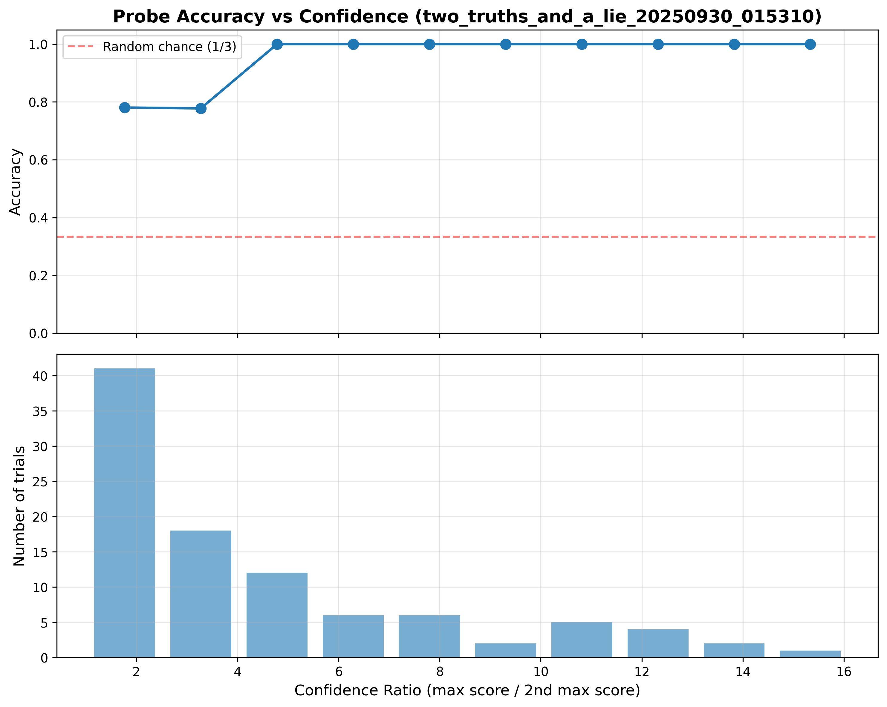
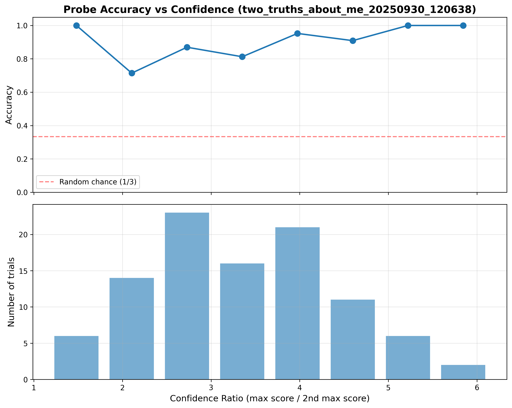
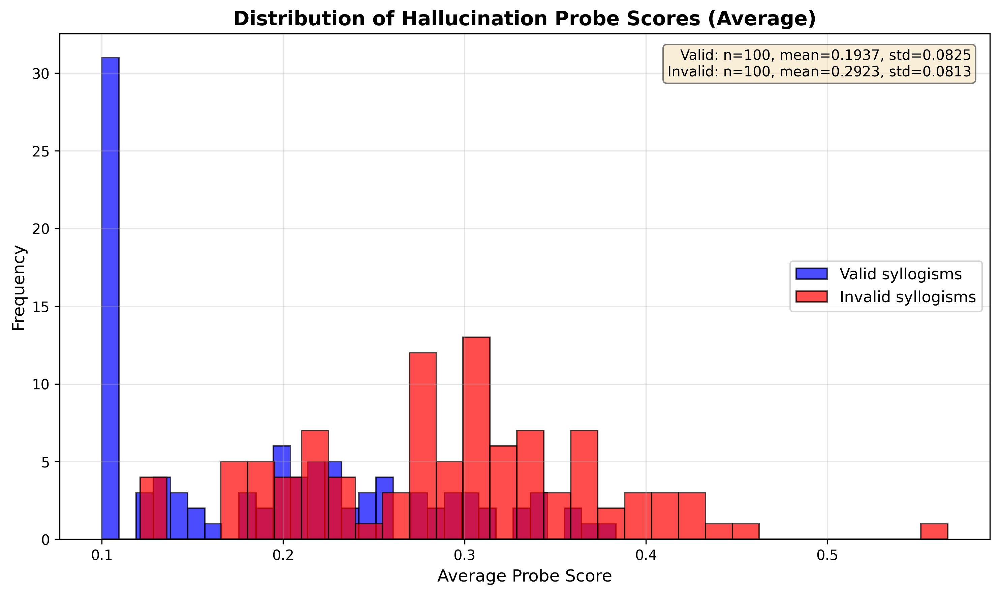
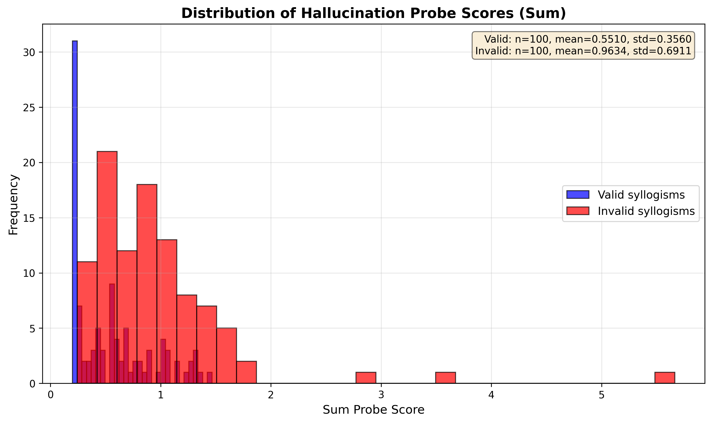
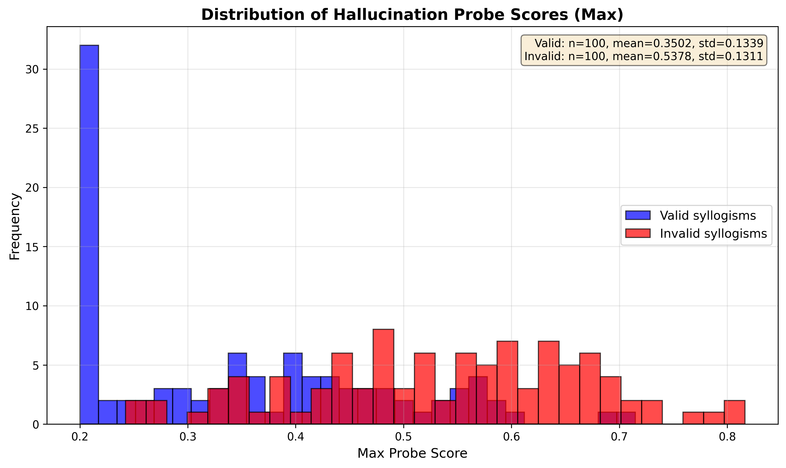

# Hallucination Probe Experiments

Out-of-distribution experiments to test the generalization of hallucination detection probes from [hallucination_probes](https://github.com/obalcells/hallucination_probes).

These experiments evaluate whether probes trained on specific datasets can detect hallucinations in different task formats and domains.

## Quick Start

```bash
# 1. Clone and setup
git clone --recurse-submodules <repo-url>
cd hallucination_outof_sample

# 2. Create virtual environment and install dependencies
python -m venv venv
source venv/bin/activate
pip install -r requirements.txt

# 3. Configure HuggingFace token
echo "HF_TOKEN=your_hf_token_here" > hallucination_probes/.env

# 4. Setup Modal (follow prompts to authenticate)
venv/bin/modal setup

# 5. Deploy the backend
venv/bin/python src/deploy_backend.py

# 6. Run an experiment
venv/bin/python src/two_truths_and_a_lie.py --num-trials 5
```

## Detailed Setup

### Prerequisites
- Python 3.11+
- HuggingFace account with access to Llama models (request access at https://huggingface.co/meta-llama)
- Modal account (sign up at https://modal.com)

### Installation

```bash
# Clone repository with submodule
git clone --recurse-submodules <repo-url>
cd hallucination_outof_sample

# Or if already cloned without submodules
git submodule update --init --recursive

# Create virtual environment
python -m venv venv
source venv/bin/activate  # On Windows: venv\Scripts\activate

# Install all dependencies
pip install -r requirements.txt
```

### Configuration

1. **HuggingFace Token**: Create `hallucination_probes/.env`:
   ```
   HF_TOKEN=hf_your_token_here
   ```

2. **Modal Setup**: Authenticate with Modal:
   ```bash
   venv/bin/modal setup
   ```

3. **Deploy Backend**: Deploy the inference backend to Modal:
   ```bash
   venv/bin/python src/deploy_backend.py
   ```

   This will deploy the backend with Llama 3.1 8B on 1x H100 GPU.

## Running Experiments

### Quick Examples

```bash
# Run two truths and a lie experiment with 10 trials
venv/bin/python src/two_truths_and_a_lie.py --num-trials 10

# Run with specific topic
venv/bin/python src/two_truths_and_a_lie.py "quantum physics" --num-trials 5

# Run two truths about me with generated facts
venv/bin/python src/two_truths_about_me.py --num-trials 5

# Run with specific facts about a person
venv/bin/python src/two_truths_about_me.py --facts "Name: Alice" "Age: 28" "Job: Teacher"
```

## Experiments

### 1. Two Truths and a Lie (`src/two_truths_and_a_lie.py`)

Tests whether the hallucination probe can identify which statement is a lie when the model generates two truths and a lie about a topic.

**How it works:**
1. Model generates two truths and a lie about a topic (or auto-generates a random topic)
2. Probe analyzes each statement and calculates average hallucination probability
3. Probe guesses the lie is the statement with highest probability
4. Model is asked to reveal which statement is the lie
5. Compare probe's guess with model's answer

**Usage:**
```bash
# With auto-generated topics
venv/bin/python src/two_truths_and_a_lie.py --num-trials 10

# With specific topic
venv/bin/python src/two_truths_and_a_lie.py "quantum physics" --num-trials 5

# Custom log file
venv/bin/python src/two_truths_and_a_lie.py --num-trials 3 --log-file logs/my_experiment.jsonl
```

**Parameters:**
- `topic` (optional): Topic for two truths and a lie. If not provided, model generates random topics
- `--probe-id`: Probe to use (default: `llama3_1_8b_lora_lambda_kl=0.5`)
- `--temperature`: Sampling temperature (default: 0.7)
- `--num-trials`: Number of trials to run (default: 1)
- `--log-file`: Path to log file (default: auto-generated with timestamp in logs/)

**Output:**
- Console output showing each trial's results
- JSONL log file with detailed results for each trial
- Summary statistics if multiple trials

**Results (N=100 trials):**
- Probe accuracy: **86.7%** (85/98 successful trials)
- Failed trials: 2 (timeouts)
- Mean confidence ratio: 4.550
- The probe successfully generalized to this out-of-distribution task format



### 2. Two Truths About Me (`src/two_truths_about_me.py`)

Variant where the model is given facts about a person and must generate two truths and a lie based on those facts.

**How it works:**
1. Provide facts about a person (or auto-generate random facts)
2. Model generates two truths and a lie based on the facts
3. Probe analyzes each statement
4. Same evaluation process as experiment #1

**Usage:**
```bash
# With specific facts
venv/bin/python src/two_truths_about_me.py --facts "My name is Bob" "I am 35" "I am a plumber" "I like dogs"

# With auto-generated facts
venv/bin/python src/two_truths_about_me.py --num-trials 5

# Multiple trials with same facts
venv/bin/python src/two_truths_about_me.py --facts "Name: Alice" "Age: 28" "Job: Teacher" --num-trials 3
```

**Parameters:**
- `--facts`: List of facts about the person (if not provided, generates random facts)
- `--probe-id`: Probe to use (default: `llama3_1_8b_lora_lambda_kl=0.5`)
- `--temperature`: Sampling temperature (default: 0.7)
- `--num-trials`: Number of trials to run (default: 1)
- `--log-file`: Path to log file (default: auto-generated with timestamp)

**Results (N=100 trials):**
- Probe accuracy: **87.0%** (87/100 successful trials)
- Failed trials: 0
- Mean confidence ratio: 3.407
- The probe successfully generalized to this variant with slightly lower confidence ratios



### 3. Syllogistic Reasoning (`src/syllogistic_reasoning.py`)

Tests whether the hallucination probe can distinguish between valid and invalid syllogisms.

**How it works:**
1. Generates both valid and invalid syllogisms with various logical patterns
2. Valid patterns include: Barbara (transitive), Darii, Celarent, Ferio, Extended transitivity
3. Invalid patterns include: Affirming the consequent, Denying the antecedent, Invalid conversion, Existential to universal, Illicit major term
4. Model is prompted to complete each syllogism's conclusion
5. Probe analyzes the completion and calculates average hallucination probability
6. Valid syllogisms should produce LOW probe scores (correct reasoning)
7. Invalid syllogisms should produce HIGH probe scores (flawed reasoning)

**Usage:**
```bash
# Run with default settings (10 trials)
venv/bin/python src/syllogistic_reasoning.py

# Run with custom number of trials
venv/bin/python src/syllogistic_reasoning.py --num-trials 20

# Custom log file
venv/bin/python src/syllogistic_reasoning.py --num-trials 5 --log-file logs/my_syllogisms.jsonl
```

**Parameters:**
- `--probe-id`: Probe to use (default: `llama3_1_8b_lora_lambda_kl=0.5`)
- `--temperature`: Sampling temperature (default: 0.7)
- `--num-trials`: Number of syllogism pairs to test (1 valid + 1 invalid each, default: 10)
- `--log-file`: Path to log file (default: auto-generated with timestamp in logs/)

**Results (N=100 pairs, 200 syllogisms total):**

| Metric | Valid Syllogisms | Invalid Syllogisms | Difference |
|--------|------------------|-------------------|------------|
| **Average** probe score | 0.1937 (±0.0825) | 0.2923 (±0.0813) | +0.0986 (51% higher) |
| **Sum** probe score | 0.5510 (±0.3560) | 0.9634 (±0.6911) | +0.4124 (75% higher) |
| **Max** probe score | 0.3502 (±0.1339) | 0.5378 (±0.1311) | +0.1876 (54% higher) |

The probe produces significantly higher hallucination scores for invalid syllogisms across all metrics. The model is prompted to complete only the missing word(s) in the conclusion, allowing the probe to directly measure hallucination on the logical reasoning step itself.

**Average Probe Score:**


**Sum Probe Score:**


**Max Probe Score:**


**Example prompt and completion:**
```
Given the following premises:

1. All A are B
2. All B are C
3. All C are D

Complete this conclusion with ONLY the missing word(s). Do not explain or add extra text.

Therefore, All A are _____

Model output: "D" (probe score: 0.12)
```

**Analyzing Results:**
```bash
# Plot histogram of probe scores (avg, sum, or max)
venv/bin/python src/plot_syllogism_histogram.py logs/syllogistic_reasoning_20250930_165545.jsonl --score-type avg
venv/bin/python src/plot_syllogism_histogram.py logs/syllogistic_reasoning_20250930_165545.jsonl --score-type sum
venv/bin/python src/plot_syllogism_histogram.py logs/syllogistic_reasoning_20250930_165545.jsonl --score-type max

# Custom output location and bins
venv/bin/python src/plot_syllogism_histogram.py logs/experiment.jsonl --score-type avg --output plots/histogram.png --bins 40
```

## Additional Tools

### CLI Interface

Direct programmatic access to the hallucination probe backend:

```bash
cd hallucination_probes/demo

# Basic usage
../../venv/bin/python cli_interface.py "What is the capital of France?" --max-tokens 50

# With custom parameters
../../venv/bin/python cli_interface.py "Tell me about quantum computing" \
    --probe-id "llama3_1_8b_lora_lambda_kl=0.5" \
    --max-tokens 256 \
    --temperature 0.5 \
    --threshold 0.4

# JSON output
../../venv/bin/python cli_interface.py "What is AI?" --json
```

### Streamlit UI

Interactive web interface for hallucination detection:

```bash
cd hallucination_probes/demo
../../venv/bin/streamlit run probe_interface.py
```

Open http://localhost:8501 in your browser.

## Available Probes

Probes are from the `andyrdt/hallucination-probes` repository. Some available probes for Llama 3.1 8B:

- `llama3_1_8b_lora_lambda_kl=0.5`
- `llama3_1_8b_lora_lambda_kl=0.99`
- `llama3_1_8b_lora_linear_n=1000`
- `llama3_1_8b_lora_linear_n=2000`
- `llama3_1_8b_lora_linear_n=4000`

See the [repository](https://huggingface.co/andyrdt/hallucination-probes) for full list.

## Logs

## Analyzing Results

### Plot Results

Analyze experiment results and plot accuracy vs confidence:

```bash
# Plot results from a log file
venv/bin/python src/plot_results.py logs/two_truths_and_a_lie_20250930_010301.jsonl

# Save plot to specific location
venv/bin/python src/plot_results.py logs/experiment.jsonl --output plots/results.png

# Custom title and number of bins
venv/bin/python src/plot_results.py logs/experiment.jsonl --title "My Experiment" --bins 15
```

The plotting script:
- Calculates confidence as the ratio of max probe score to second-highest score
- Bins trials by confidence and plots accuracy for each bin
- Shows histogram of confidence distribution
- Prints summary statistics

### Log Format

All experiments save results to `logs/` directory in JSONL format (one JSON object per line).

Each log entry contains:
- Timestamp
- Probe ID and parameters
- Generated statements
- Probe scores for each statement
- Probe's guess
- Model's answer
- Whether probe was correct

## Backend Configuration

### Deploying the Backend

Use the deployment script to deploy the Modal backend:

```bash
# Deploy with default settings (8B model, 1 GPU)
./venv/bin/python src/deploy_backend.py

# Deploy with custom model and GPU count (passed to experiments via switch_model())
./venv/bin/python src/deploy_backend.py --model meta-llama/Meta-Llama-3.1-70B-Instruct --gpus 2
```

The deployment script (`src/deploy_backend.py`):
- Automatically loads HF_TOKEN from environment or `.env` file
- Shows current backend configuration before deploying
- Uses the venv's modal installation if available
- Provides clear status messages during deployment

### Backend Settings

The Modal backend (`hallucination_probes/demo/modal_backend.py`) is configured to:
- Default model: Llama 3.1 8B (can be changed by redeploying or using `switch_model()`)
- Run on 1x H100 GPU by default
- Scale down after 2 minutes of inactivity
- Timeout after 15 minutes

Experiments can switch models dynamically using the `model_name` parameter in `run_experiment()`, which calls `switch_model()` on the backend.
